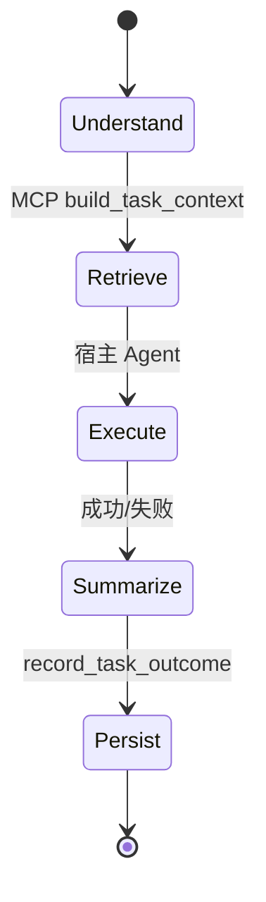

# DEVELOPMENT_SPEC — Project Brain Agent v1

> 编译自 `.requirementmind/*.json`（revision 2026-09-03）。读者是无对话历史的 Coding Agent。

# Goal

在**独立仓库** `project-brain-agent` 中交付 v1：**Project Brain MCP 中间层**，为 **Cursor** 与 **OpenHands Agent Server** 提供项目上下文、经验记忆（Mem0）、文档/知识检索（LlamaIndex + Qdrant），并在 **Token 预算**内组装上下文，支撑一条可验收的「理解 → 检索 → 执行修改」闭环。

判定做对了：[DEC-011] 三条验收（T1 问答、T2 修改流程、T3 Token ≤5000 检索上下文）在 **fixture 项目**上通过。

# Current System Facts

- [FACT-001] 当前工作区 `project-brain-mind` 是 Agent Canvas 前端，不是 Agent Runtime（`AGENTS.md:3`）。
- [FACT-002] Agent Loop/Tool 在 `software-agent-sdk`；本 Canvas 仓禁止塞入 Brain 后端（`AGENTS.md:47`）。
- [FACT-011] `Downloads/11111` 含 Mem0/Qdrant/LlamaIndex 等，**无** OpenHands SDK 源码。
- [FACT-012] Mem0 Python 包 `mem0ai`，依赖含 `qdrant-client`（`mem0-main/pyproject.toml:16`）。
- [FACT-021] Canvas 仓无 Project Brain 的 PG/Qdrant schema。
- [FACT-022] Canvas 仅有 MCP **配置 UI**，无 `search_memory` 等 Brain 工具实现（`src/api/mcp-health/probe-mcp-server-health.ts:1`）。

# Scope

1. **新建** `project-brain-agent`  monorepo/多包布局（见 Files Expected）。
2. **docker-compose**：Qdrant、可选 Postgres、brain-api、mcp-server。
3. **memory-service**：Mem0 OSS → collection `memory_experience`（[DEC-007]）。
4. **knowledge-service**：LlamaIndex → collection `knowledge_document`；`code_index` / `skill_index` 可建空壳。
5. **project-context-service**：YAML/JSON 项目元数据（name、language、framework、rules）。
6. **mcp-server**：v1 工具集（见 API Changes）；stdio 或 SSE，供 Cursor 与 OpenHands 配置。
7. **Token 预算层**：分层加载与硬上限（见 Frozen Business Rules）。
8. **Fixture**：`demo-spring-project`、`demo-python-crawler` + 种子记忆/文档。
9. **测试**：单元 + 集成 + Token 计数测试。

# Out of Scope

- [DEC-009] 修改 OpenHands Agent Loop / fork `software-agent-sdk`。
- [DEC-009] SCIP、Joern、Skill Evolution、Semgrep 自动 Review、自动测试 Agent。
- [DEC-008] 真实业务仓（淘宝采集、抖音百应、生产退款、blender-mind）。
- [DEC-002] 在 `openhands-agent-canvas` 的 `src/**` 实现 Brain 后端（v1 默认 [Q-009] 见 Open Questions）。
- Vendor `Downloads/11111` 源码进产品仓 [DEC-005]。

# Frozen Business Rules

- [DEC-001] Gate 通过前不写 Brain 业务代码；本规格即为 v1 编码依据。
- [DEC-002] Brain 独立仓；Canvas 仅未来 MCP 配置入口，v1 不强制改 Canvas。
- [DEC-003] 单一 MCP 服务双宿主（Cursor + OpenHands）。
- [DEC-004] OpenHands 仅消费已发布 agent-server，不改核心。
- [DEC-005] 第三方运行时 Docker/PyPI，不 vendor 下载目录源码。
- [DEC-006] v1 = Context + Memory + MCP + Token + 一条 Agent 流程。
- [DEC-007] Mem0 ↔ 经验；LlamaIndex ↔ 文档/知识；**禁止**同 collection 双写；collections：`memory_experience`、`knowledge_document`、`code_index`、`skill_index`。
- [DEC-008] 验收仅用合成 fixture。
- [DEC-011] T1/T2/T3 验收口径；T2 不要求完整 skill-engine，可返回 demo skill 或空。

# Database Changes

**Qdrant**（必须）：

| Collection | 写入方 | v1 内容 |
|------------|--------|---------|
| `memory_experience` | Mem0 | 经验、决策、Bug 摘要 |
| `knowledge_document` | LlamaIndex | README、架构说明、fixture 文档 |
| `code_index` | 预留 | v1 空或手动 chunk fixture 源码 |
| `skill_index` | 预留 | v1 空 |

**Postgres（optional）** [DEC-005]：若 Mem0 配置需要 SQLAlchemy 元数据，使用 Mem0 官方配置；**禁止**再建与 Mem0 重复的 `memories` 业务表。项目注册表可单表 `projects(id, name, config_json)`。

# API Changes

## HTTP（brain-api，内部）

| Method | Path | 用途 |
|--------|------|------|
| POST | `/v1/context/build` | 输入 task + project_id，输出分层 context + token 计数 |
| POST | `/v1/memory/search` | 包装 Mem0 search |
| POST | `/v1/memory/add` | 任务结束写入经验 |
| POST | `/v1/knowledge/search` | LlamaIndex query |
| GET | `/v1/projects/{id}` | project-context |

## MCP Tools（v1 对外）

| Tool | 输入 | 输出 |
|------|------|------|
| `search_project` | `project_id`, `query` | 项目 rules + metadata |
| `search_memory` | `project_id`, `query`, `limit` | Mem0 hits（≤5 条） |
| `search_knowledge` | `project_id`, `query`, `top_k` | LlamaIndex chunks |
| `build_task_context` | `project_id`, `task`, `budget_tokens` | 合并 L0–L2 上下文 + 用量 |
| `record_task_outcome` | `project_id`, `summary`, `importance` | 写入 Mem0 |

v1 **不实现**：`analyze_code`（SCIP）、`get_call_chain`、`get_bug_history`（可 stub 返回 `NOT_IN_V1`）。

错误：工具失败返回 MCP `isError` + 可读 message；不抛未捕获栈到宿主。

# State Machine

v1 无复杂业务状态机。任务流：



# Validation Rules

- `project_id` 必须存在于 `projects` 注册。
- `budget_tokens` 默认 5000，最大 16000 [DEC-011 T3]。
- `search_memory.limit` ≤ 5。
- 禁止一次 MCP 调用返回超过 `budget_tokens` 估算的文本。

# Permission Rules

v1：单租户本地部署；`X-Brain-Api-Key` 可选 env 鉴权。无多用户 RBAC。

# Concurrency Rules

Mem0/LlamaIndex 调用允许并发读；同一 `project_id` 的 `record_task_outcome` 顺序写入即可，无强事务要求 v1。

# Idempotency

`record_task_outcome` 可选 `client_request_id` 去重（v1 推荐，非强制）。

# Exception Handling

- Qdrant 不可用：MCP 工具返回错误，brain-api `/health` 为 503。
- Mem0 失败：降级为仅 knowledge + project context，并在响应中 `warnings[]`。
- Token 超限：截断 L2，保留 L0+L1。

# Impact Analysis

**openhands-agent-canvas**（本工作区）：v1 **无必须改动**。若未来加 MCP 配置 UI，仅 touch `src/components/features/mcp-page/` 与 settings，不涉及 Brain 逻辑（`FACT-022`）。

**software-agent-sdk**：仅通过用户配置的 MCP 条目连接，**无代码改动** [DEC-004]。

# Compatibility Requirements

- OpenHands agent-server ≥ 1.28.0（与 Canvas `config/defaults.json` 一致）仅作 MCP 客户端。
- Mem0 / LlamaIndex 版本锁定在 `requirements.txt` / lockfile。

# Files Expected To Change

**仅在新仓 `project-brain-agent/`**（本规格阶段可在本 meta 仓生成文档与 prompt；编码时 clone 新仓）：

```
project-brain-agent/
  docker-compose.yml
  pyproject.toml / requirements.txt
  services/
    brain-api/
    mcp-server/
    memory-service/
    knowledge-service/
    project-context-service/
  packages/brain-core/   # token budget, types
  tests/
  fixtures/
    demo-spring-project/
    demo-python-crawler/
```

# Files Forbidden To Change

在 **agent-canvas** 仓（`project-brain-mind`）实现 v1 时：

- `src/api/agent-server-adapter.ts` 等 Agent 执行路径（除非用户另开 DEC supersede）。
- OpenHands SDK 任何仓库。

# Acceptance Criteria

**T1** [DEC-011]  
Given fixture `demo-spring-project` 已 ingest 规则与一篇「退款模块设计」文档  
When 宿主通过 MCP 问「这个项目退款模块怎么设计？」  
Then `build_task_context` 返回含 project rules、≥1 memory 或 knowledge 命中，且 token 计数 ≤5000。

**T2** [DEC-011]  
Given 同上 + 一条历史 Bug 经验在 Mem0  
When 任务「修改 RefundService#apply 方法」  
Then 流程调用 `search_memory` → `build_task_context` → 宿主 Agent 能定位 fixture 中对应文件（不要求 SCIP）。

**T3** [DEC-011]  
Given 全量读 fixture 源码基线 ~30000 token（测试脚本静态估算）  
When 走 Project Brain 检索路径  
Then 注入上下文字数/ token ≤5000。

# Required Tests

- `tests/unit/test_token_budget.py` — 截断与上限。
- `tests/integration/test_mcp_tools.py` — 五工具 happy path。
- `tests/integration/test_mem0_qdrant_collections.py` — collection 名隔离。
- `tests/acceptance/test_t1_t2_t3.py` — 映射 DEC-011。

# Known Risks

- [ASM-003] 70–90% Token 降幅为愿景，v1 仅强制 ≤5000 检索上下文；需实测基线。
- [Q-009 OPEN] Canvas v1 是否改 UI：默认 A（零改动），见 Open Questions。

# Frozen Decisions

| id | topic | 状态 |
|----|-------|------|
| DEC-001 … DEC-011 | 见 `.requirementmind/decisions.json` | FROZEN |

# Open Questions

- [Q-009] Canvas v1 MCP 配置 UI：**默认 A** — v1 零改动 agent-canvas，仅用 Cursor/OpenHands MCP 配置文件连接 Brain。若需 B，须新 DEC supersede。

# Development Gate

`gate.json`: **READY_FOR_DEVELOPMENT**（2026-09-03）。blocking_questions=0, blocking_conflicts=0。
